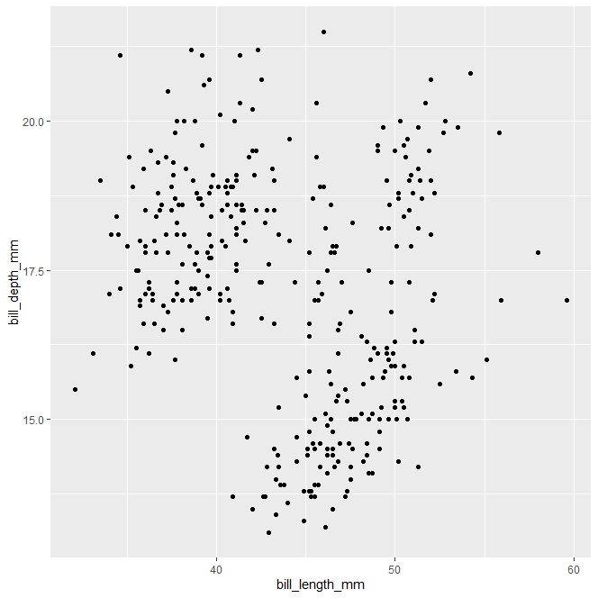

# Aesthetic Points
-  X, Y
```
ggplot(data = penguins) + geom_point(mapping = aes(x = flipper_length_mm, y = body_mass_g))	
```

- Color
```
ggplot(data = penguins) + geom_point(mapping = aes(x = flipper_length_mm, y = body_mass_g, color = species))
```


**If we want to change the appearance of our overall plot without regard to specific variables, we write code oustside of the aes function**
```
ggplot(data = penguins) + geom_point(mapping = aes(x = flipper_length_mm, y = body_mass_g), color = 'purple')
```

- Shape
```
ggplot(data = penguins) + geom_point(mapping = aes(x = flipper_length_mm, y = body_mass_g, shape = species))

```

- Size
```
ggplot(data = penguins) + geom_point(mapping = aes(x = flipper_length_mm, y = body_mass_g, size = species, shape = species, color = species))

```

- Alpha
```
ggplot(data = penguins) + geom_point(mapping = aes(x = flipper_length_mm, y = body_mass_g, alpha = species))
 
```


